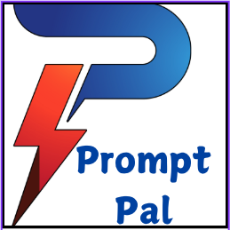

<p align="center">
  
</p>

<h1 align="center">PromptPal</h1>

<p align="center">
  A privacy-focused, offline-first teleprompter web application with a unique spotlight reading feature.
</p>

<p align="center">
  🚀 <a href="https://prompt-pal.tiiny.site/">Try it live!</a>
</p>

## Why Another Teleprompter?

Most teleprompter applications available today come with limitations:
- They're either paid or require subscriptions
- They're cloud-based, raising privacy concerns
- They lack essential features for comfortable reading
- They require internet connectivity

PromptPal was born over a weekend to address these limitations. As a content creator making YouTube videos, I needed a simple yet effective teleprompter that would work offline and help me maintain eye contact with the camera while reading scripts naturally.

What makes PromptPal special is its unique spotlight feature - a focused reading area that helps you concentrate on the current text while maintaining context of what's coming next.

## Demo

<p align="center">
  <video width="100%" controls>
    <source src="demo-video.mov" type="video/quicktime">
    Your browser does not support the video tag.
  </video>
</p>

## Features

- 🌓 Dark/Light mode toggle for comfortable reading
- 🎯 Unique spotlight focus area for natural reading
- 🔄 Adjustable scroll speeds (Slow/Medium/Fast)
- 📝 Multiple font size options (Small/Medium/Large)
- 🖥️ Fullscreen mode support
- 🏃‍♂️ Smooth auto-scrolling functionality
- ⌨️ Spacebar control for quick pause/resume
- 🔒 Completely offline - works without internet
- 📱 Responsive design - works on all devices

## Getting Started

### Prerequisites

- A modern web browser
- No additional installations required!

### Live Demo

The application is publicly hosted and can be accessed at:
[https://prompt-pal.tiiny.site/](https://prompt-pal.tiiny.site/)

No installation needed - just open the URL in your browser and start using it!

### Installation

1. Clone the repository:

```bash
git clone https://github.com/testronai/prompt-pal.git
```

2. Open `index.html` in your web browser

That's it! No build process, no dependencies to install.

## Usage

1. Open the application in your browser
2. Paste or type your script in the text area
3. Adjust font size and scroll speed as needed
4. Click 'Start' to begin auto-scrolling
5. Use the spotlight area to maintain focus while reading
6. Press spacebar to pause/resume scrolling
7. Toggle full screen for distraction-free reading

## Tech Stack

- HTML5
- CSS3
- JavaScript
- Bootstrap 4.5.2
- jQuery (slim version)
- Popper.js

## Browser Support

- Chrome (recommended)
- Firefox
- Safari
- Edge
- Opera

## Contributing

Contributions are welcome! Please feel free to submit a Pull Request.

1. Fork the project
2. Create your feature branch (`git checkout -b feature/AmazingFeature`)
3. Commit your changes (`git commit -m 'Add some AmazingFeature'`)
4. Push to the branch (`git push origin feature/AmazingFeature`)
5. Open a Pull Request

## License

This project is licensed under the MIT License - see the [LICENSE](LICENSE) file for details.

## Acknowledgments

- Inspired by [Promptr.co](https://promptr.co/) - While I loved their teleprompter app, I needed something that works offline with a focus area feature, which led to building PromptPal
- Thanks to the Bootstrap team for their excellent framework

## Contact

Your Name - [@sahajamit](https://twitter.com/@sahajamit)

Project Link: [https://github.com/testronai/prompt-pal](https://github.com/testronai/prompt-pal)
